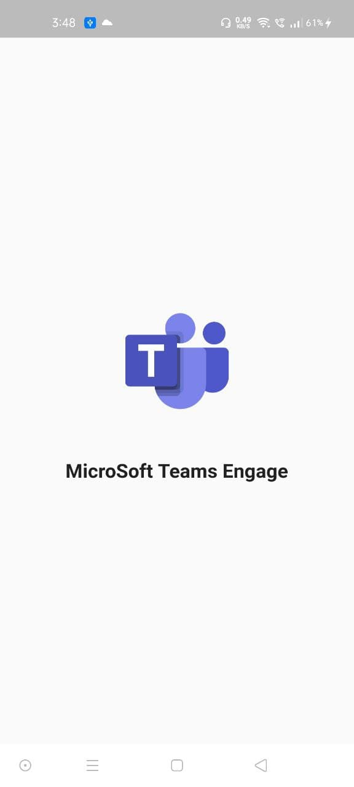
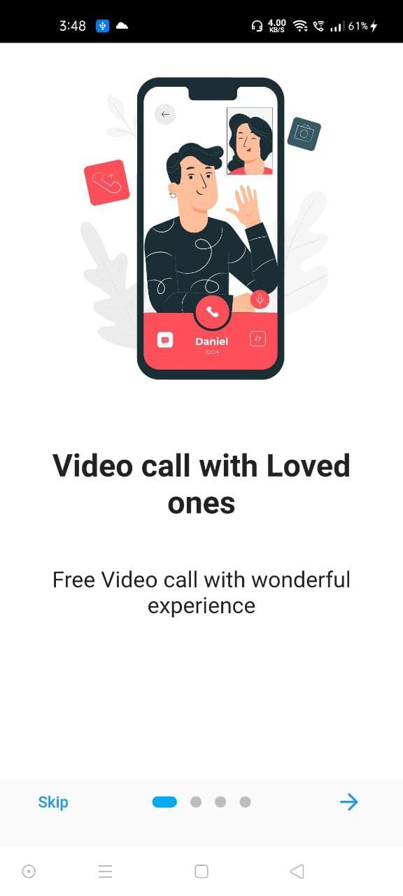
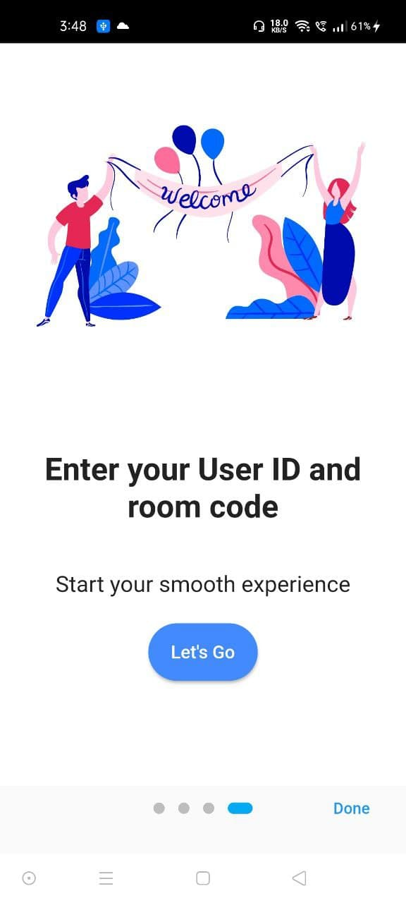
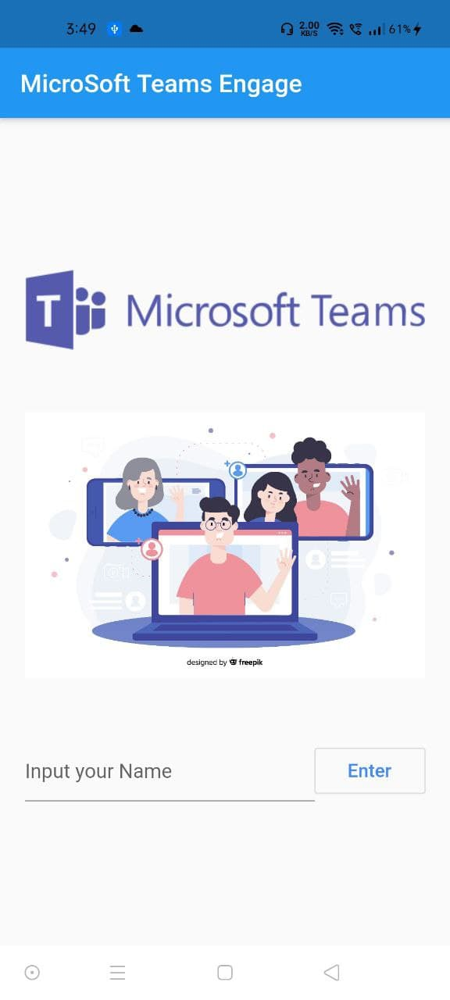
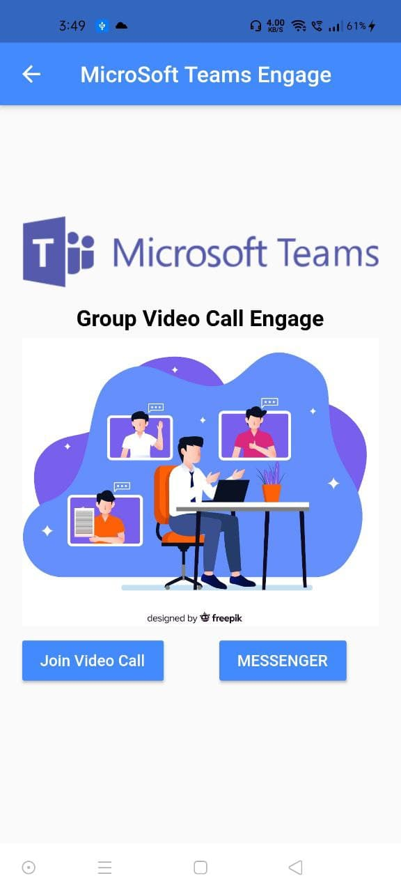
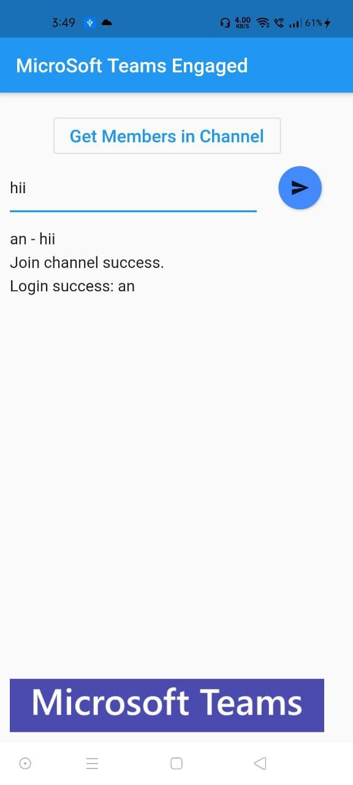
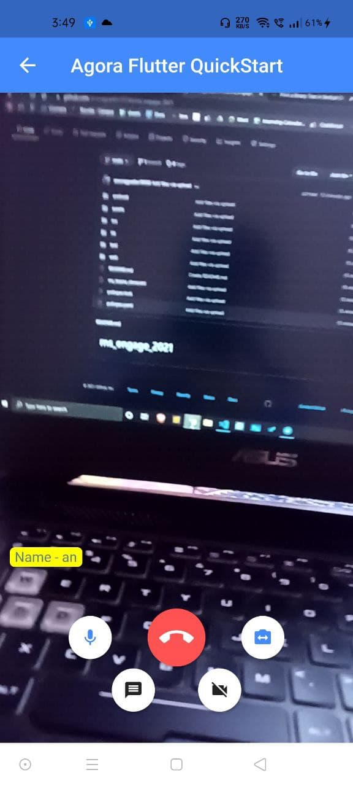

# ms_engage_2021

I made this Microsoft Clone App in Microsoft Engage 2021.

You can download and run this app .

If you also want to make this project
Prerequisites
Agora.io Developer Account
Flutter 1.0.0

Create an Account and Obtain an App ID
To build and run the sample application, first obtain an app ID:

Create a developer account at agora.io. Once you finish the sign-up process, you are redirected to the dashboard.
Navigate in the dashboard tree on the left to Projects > Project List.
Copy the app ID that you obtain from the dashboard into a text file. You will use this when you launch the app.

Some ScreenShots of the App. 
!

 

Resources 
Complete API documentation at the Developer Center 
File bugs about this sample 
Flutter lab: Write your first Flutter app 
Flutter cookbook: Useful Flutter samples 
Flutter online documentation, which offers tutorials, samples, guidance on mobile development, and a full API reference. 
Credit 
https://console.agora.io/ 
https://pub.dartlang.org/packages/permission_handler 
https://www.freepik.com/ for vector images used in project 
